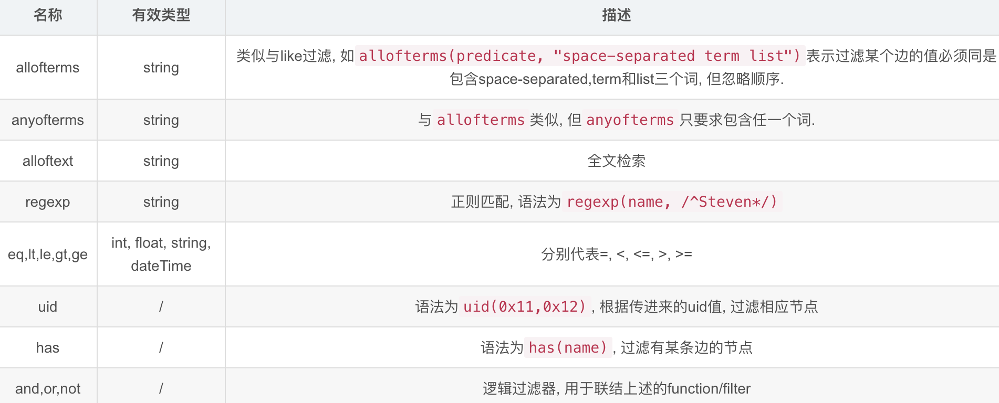

# godemo

>用go加速数据处理工作：
1. 协程

---

### 快速上手
  ```
  1. 下载go
  2. tar -C /usr/local -xzf go1.15.5.linux-amd64.tar.gz
  3. 设置环境变量 ~/.bash_profile
  export GOROOT=/usr/local/go
  PATH="$GOROOT/bin:${PATH}"
  export PATH
  export GOPATH=/Users/roger/go
  export GOPROXY=https://mirrors.aliyun.com/goproxy/
  source ~/.bash_profile

  go mod init  # 初始化go.mod
  go mod tidy  # 更新依赖文件
  go mod download  # 下载依赖文件
  go mod vendor  # 将依赖转移至本地的vendor文件
  go mod edit  # 手动修改依赖文件
  go mod graph  # 打印依赖图
  go mod verify  # 校验依赖

  4. 安装依赖包
  sudo go get -u github.com/go-sql-driver/mysql
  sudo go get go.mongodb.org/mongo-driver/mongo
  
  sudo go get -u github.com/ip2location/ip2location-go # 如果仅需要查询IPv4地址，请使用IPv4 BIN文件。
  ```

### 项目说明


### Reference
- [build-web-application-with-golang](https://github.com/astaxie/build-web-application-with-golang/blob/master/zh/preface.md)
   中文参考文档。
- [awesome-go](https://github.com/avelino/awesome-go)
  
- [mongodb driver](http://github.com/mongodb/mongo-go-driver)
  The MongoDB supported driver for Go.

- [TheAlgorithms for Go](https://github.com/TheAlgorithms/Go)
- [json-iterator for Go](https://github.com/json-iterator/go)
  go get github.com/json-iterator/go

- [dgraph](https://dgraph.io/tour/)
  ```
  连接数据，例如需要连接的SQL表
  高级搜索
  推荐引擎
  模式检测
  网络
  流程，例如商业流程及生物流程
  事件以及它们之间的因果或其他联系
  公司或者市场的结构
  ```
  Dgraph使用function和filter对查询数据进行过滤. 在dgraph中function和filter的区别仅在于放位置的不同.下面是支持的function和filter:
  
  dgraph可以通过as关键词将一个查询块的任意部分设为一个变量, 以供后面的子查询或者其它查询块使用. 这个变量本质上是一个uid列表, 因此要利用uid函数进行引用.
  [贝壳](https://www.6aiq.com/article/1586914787766)
  ```
  {
    #查询名叫"Peter Jackson"的人的自导自演电影和扮演的角色
    PJ as var(func:allofterms(name, "Peter Jackson")) {
      F as director.film
    }

    peterJ(func: uid(PJ))  {
      name 
      actor.film {
        performance.film @filter(uid(F)) {
          film_name: name
        }
        performance.character {
          character: name
        }
      }
    }
  }
  ```
  Dgraph 用facets描述边的自定义属性
  ```
  query
  {
    data(func: eq(name, "Alice")) {
       name
       mobile @facets(since)
       car @facets(since)
    }
  }
  ```
